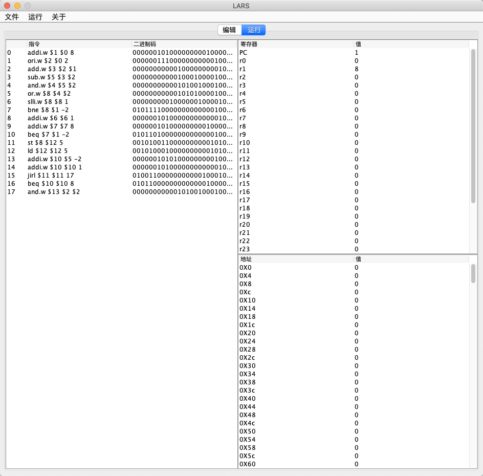

# 测试分析报告

## 1 引言

#### 1.1 编写目的

这份测试分析报告旨在展示龙芯基础指令集模拟器LARS的开发成果并使用户更全面了解本产品的特点和存在的缺陷.

#### 1.2 背景

本产品全称'龙芯基础指令集模拟器LARS',由项目参与者三人完成设计和开发.测试环境为windows上java jdk运行,测试结果可能由于jdk版本不同发生变化.

#### 1.3 定义

龙芯指令集汇编和运行时模拟器:LARS（下称本软件）。

#### 1.4 参考资料

《龙芯架构参考手册 卷一：基础架构》--龙芯中科

## 2 测试概要

| 测试流程 | 测试内容                                               |
| -------- | ------------------------------------------------------ |
| UI测试   | 本测试主要内容在于测试用户界面的所有功能模块是否正常   |
| 编译测试 | 本测试主要内容在于测试所有的编译指令是否都编译结果正确 |
| 综合测试 | 本测试主要内容在于运行编译代码测试运行结果是否正确     |

## 3 测试结果及发现

### UI测试

主要的测试功能为文件，运行，关于三大模块

#### 文件模块

文件中有如下功能

测试如下：

##### 打开

##### 关闭

读入test.asm，然后采用关闭按键，可以正常关闭。

##### 保存

修改test.asm的第一行代码，可以成功保存。

##### 另存为

可成功另存为test_mod.asm

#### 运行模块

##### 编译

可以成功编译，结果如下：

##### 单步运行

单步运行后第一条指令被执行，寄存器的值发生改变

##### 全部运行

所有指令执行完毕。

#### 关于模块

可以成功展示开发者

### 编译测试

所有指令的编译结果如下，可比照指令表，结果正确。

### 综合测试

本次综合测试采用了test.asm文件作为测试。下面将进行仔细分析单步运行后的结果。

首先编译后信息如下：

寄存器与内存状态全部为0，展示如下：

下面介绍每一步的运行：

- addi.w $1 $0 8 寄存器1结果为8
- ori.w $2 $0 2 寄存器2结果为2
- add.w $3 $2 $1 寄存器3结果为10
- sub.w $5 $3 $2 寄存器5结果为8
- and.w $4 $5 $2 寄存器4结果为0
- or.w $8 $4 $2 寄存器8结果为2
- slli.w $8 $8 1 寄存器8结果为4
- bne $8 $1 -2 不相等，PC-2，跳转回上一条指令
- slli.w $8 $8 1 寄存器8结果为8
- bne $8 $1 -2 相等，继续执行
- addi.w $6 $6 1 寄存器6结果为1
- addi.w $7 $7 8 寄存器7结果为8
- beq $7 $1 -2 相等，PC-2，跳转回上一条指令
- addi.w $7 $7 8 寄存器7结果为16
- beq $7 $1 -2 不相等，继续执行
- st $8 $12 5 内存0x14存储寄存器8的值
- ld $12 $12 5 寄存器12加载内存0x14的值
- addi.w $10 $5 -2 寄存器10的值为6
- addi.w $10 $10 1 寄存器10的值为7
- jirl $11 $11 17 PC跳转到17，寄存器11的值为18
- and.w $13 $2 $2 寄存器13的值为2

最终UI展示结果正确，展示如下：

## 4 对软件功能的结论

#### 4.1 交互界面UI(Mainframe)

##### 4.1.1 能力

​	从外部读入指令文件和接受键盘输入,将编译和运行结果显示到界面上,并能提示编译错误等问题.同时能保存结果保存为.asm文件到外部.

##### 4.1.2 限制

​	测试数据包括手操点击各功能按键,键盘输入指令,打开文件后编译运行.测试期间显示出未能实现另存为结果的功能.

#### 4.2 编译器(Complier)

##### 4.2.1 能力

​	将汇编指令编译为二进制码,遇到不符合语法的指令时报错.

##### 4.2.2 限制

​	测试数据为多组指令,包括所有实现了的指令类型.测试显示对于参数类型错误的错误指令不能正确报错,而是不能显示结果.

#### 4.3 虚拟处理器(vCPU)

##### 4.3.1 能力

​	根据二进制码对寄存器内容进行存取和计算操作.

##### 4.3.2 限制

​	测试数据为从编译器编译来的二进制码组.测试中未出现缺陷.

## 5 分析摘要

#### 5.1 能力

​	本测试证实了本软件拥有读入汇编指令并编译运行的能力,且能将结果保存到寄存器中并通过交互界面显示结果和错误提示.UI测试结果显示确实实现了交互界面指令输入和结果展示.编译测试结果显示了将汇编指令编译为二进制码的能力正确实现,与预定码表吻合.综合测试结果与预取结果相符,输入指令组后各寄存器值正确且成功显示.

​	测试环境中输入的测试指令均为符合一般标准的汇编指令,没有出现参数不合规范的指令.实际环境可能会不能成功显示编译错误而直接报错.

#### 5.2 缺陷和限制

​	经测试发现将运行结果另存为的功能未实现,部分类型指令错误不能正常报错.

#### 5.3 建议

##### 1 另存为功能未实现

​	此缺陷不影响主要功能,解决办法则是在Mainframe模块修改一些代码.

###### 2 部分指令错误不能编译报错

​	此缺陷导致此类指令在点击编译后无结果,解决办法是在编译模块增加检测层数.

#### 5.4 评价

​	本软件的开发已达预定目标,能够交付使用.