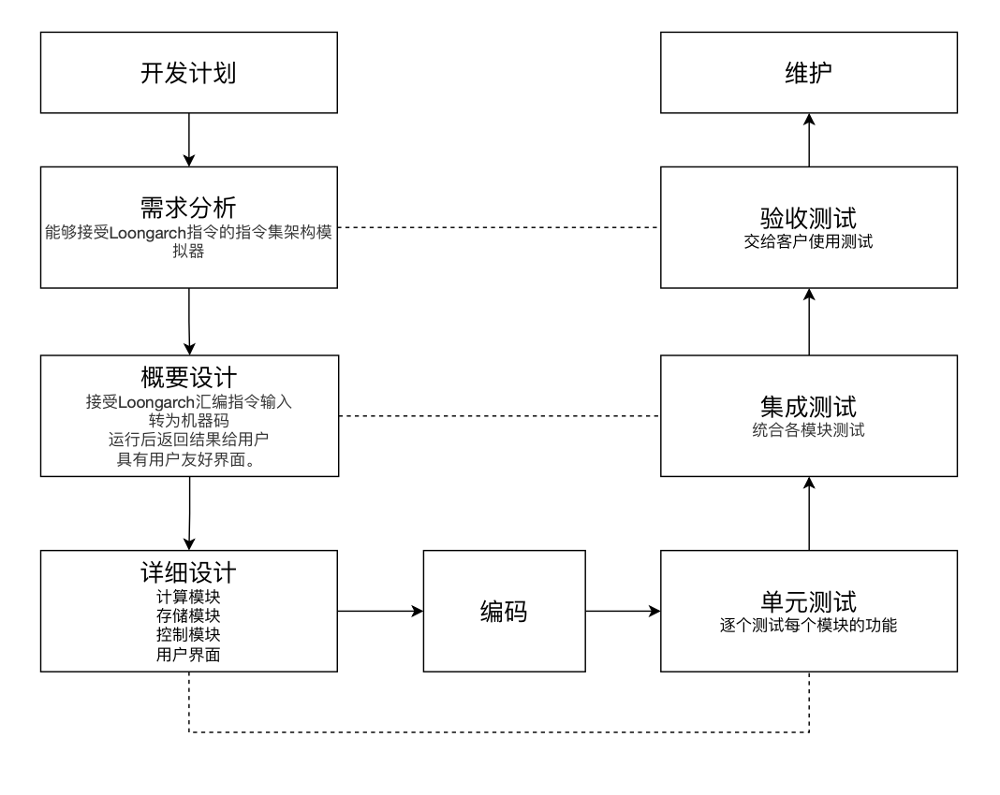

# Week3 软件工程实验报告

|组员名单| 黄梓轩 | 李嘉毅 | 梁恒中 |
|---|---|---|---|
|学号|19335085|1335098|19335119|

## 课程选题
龙芯基础指令集架构模拟器LARS(Loongarch Assembler and Runtime Simulator)
## 选题目的与意义
龙芯指令集（Loongarch）是龙芯中科于2020年推出的一个全新的指令集架构，目的在于构建独立自主的指令集生态，摆脱目前我国在处理器指令集上受制于人的状况。基于此，受到[MARS MIPS simulator](https://courses.missouristate.edu/KenVollmar/MARS/)的启发，我们小组决定开发基于龙芯基础指令集架构的指令集架构模拟器。

该选题的实际意义在于：
1. 为Loongarch指令集架构生态添砖加瓦。Loongarch作为一个新的指令集架构，其生态的建立方兴未艾。该项目的开发可以在一定程度上完善Loongarch指令集架构生态。
2. 基于目前基于Loongarch指令集架构的处理器较为稀少，价格较为高昂，该项目的开发可以降低普通开发人员接触Loongarch指令集架构的门槛，有利于推广Loongarch指令集架构。
3. 该项目的开发能够支持企业/高校围绕Loongarch指令集架构培训计算机相关技术人员，培养更多人才攻坚解决目前国家的卡脖子问题。

## 选题思路

### 预期产品功能

预期的产品功能包括：
1. 接受Loongarch汇编指令输入
2. 将Loongarch汇编编译为Loongarch机器码
3. 运行Loongarch机器码，并且向用户返回运行结果
4. 提供用户友好的用户界面

下面为更为具体的产品功能介绍。
#### 接受Loongarch汇编指令输入

LARS兼容Loongarch基础指令集的一个子集。Loongarch基础指令集是指记录在《龙芯架构参考手册 卷1：基础架构》中的指令的集合。预期兼容的指令包括但不限于：
* 用于整型标量运算的指令，包括算术运算、移位运算和位运算等。
* 用于控制跳转的指令。
* 用于访问内存的指令。

可能兼容的指令包括：

* 浮点运算指令
* SIMD指令
* 原子访问指令

#### 将Loongarch汇编编译为Loongarch机器码

LARS将根据《龙芯架构参考手册 卷1：基础架构》中提供的指令码，将用户输入的汇编指令编译为机器码，以供后续在虚拟CPU上运行。同时将在一定程度上指出用户输入中的语法错误。

#### 运行Loongarch机器码，并返回结果

LARS将实现一个虚拟的，可以执行Loongarch指令集的CPU，其实现包括：

* 至少一个ALU
* 至少一组符合龙芯架构的通用寄存器
* 至少一组用于控制ALU运行的寄存器

LARS将实现虚拟内存空间用于存储编译后的机器码和存储程序运行中需要的数据。

#### 友好的用户界面

使用可互动的用户界面，直观显示程序运行中相关寄存器的数据和内存区域的数据。可选功能包括高亮值发生改变的寄存器和内存区域。

## 开发过程

整体开发过程我们采用V模型，下图为我们开发的整体流程图。

下面我们会具体分析每个模块的内容。

#### 需求分析

实现一款能够接受Loongarch指令的指令集架构模拟器

#### 概要设计

实现预期功能中的四个内容：接受Loongarch汇编指令输入，转为机器码，运行后返回结果给用户，且具有用户友好界面。

#### 详细设计

分为多个模块与单元开发

* 计算模块
* 控制模块
* 存储模块
* 用户界面

#### 测试

单元测试->集成测试->系统测试

* 单元测试：独立测试各模块
* 集成测试：统合各模块测试
* 验收测试：交给客户使用测试

#### 交付及验收

制作使用说明

## 技术支持

### 技术原理

本模拟器采用软件模拟硬件操作流程，软件通过输入的汇编语言模拟硬件流程，最终输出对应的结果，软件成功运行需要以下的知识储备支持：

- 计算机组成原理
  - CPU组成架构
    - 计算模块
    - 控制模块
    - 寄存器模块
    - 内存模块（可选）
- 编译原理
  - 将汇编语言的编译机制与流程
- java swing
  - swing提供简洁的图形化界面

### 开发工具

预期使用Java语言开发，使用github进行组内交流。

### 技术难题

- 模拟器模块所映射的类的设计
- 模拟器模块所映射的类的组合与相互调用
- 用户界面的设计

## 相关工具支持条件

### 相关工具及平台

1. 龙芯官方提供的《龙芯架构参考手册 卷1：基础架构》，可从官网下载。
2. 预期使用Java语言开发，使用github进行组内交流。

### 技术成熟度

目前龙芯基础指令集架构已经很完善，可以完全支持指令集机构模拟器的开发。