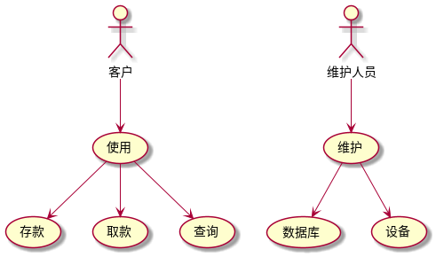
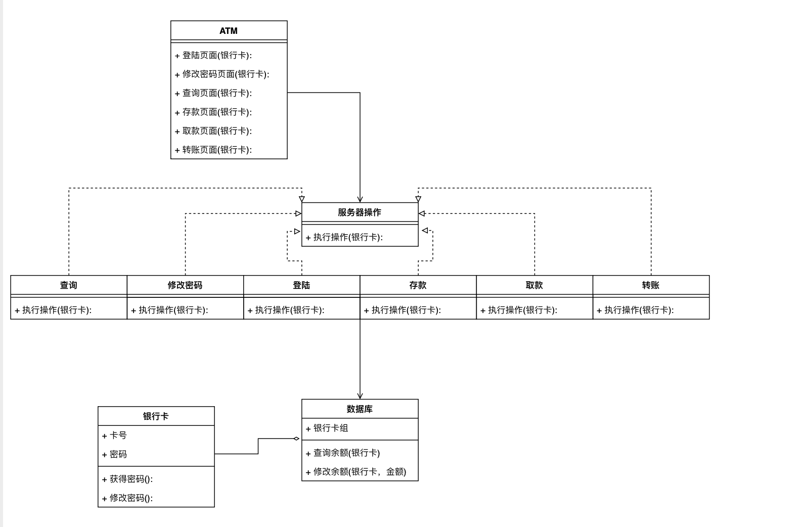
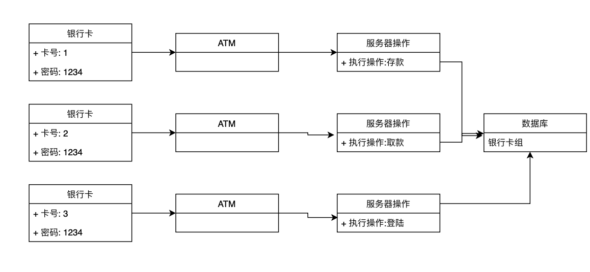
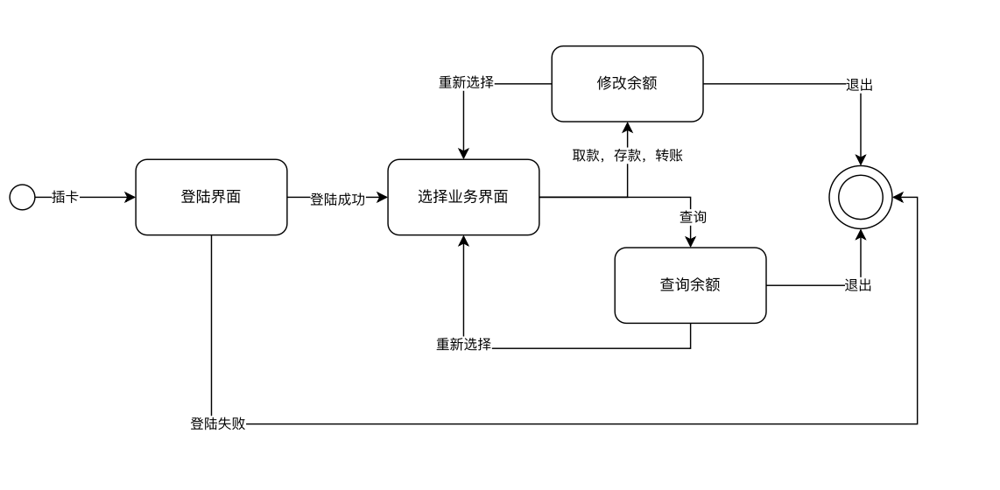
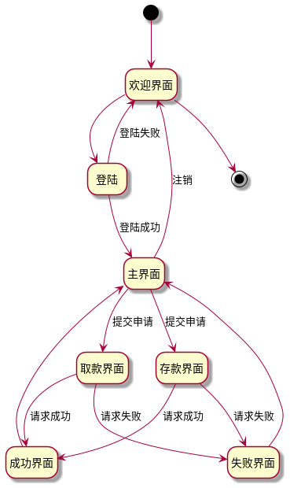
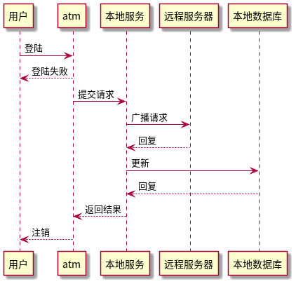
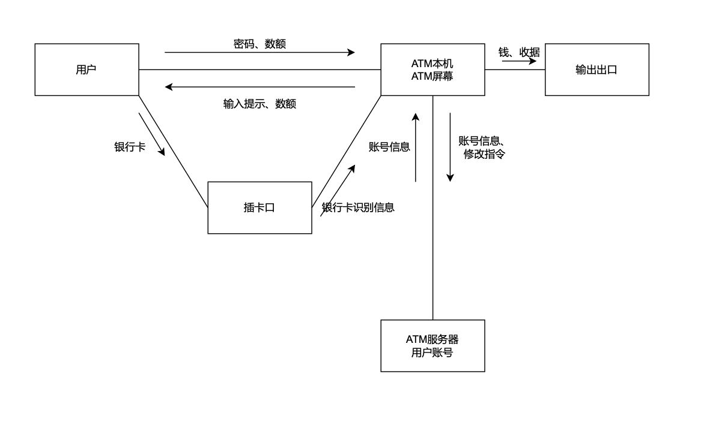
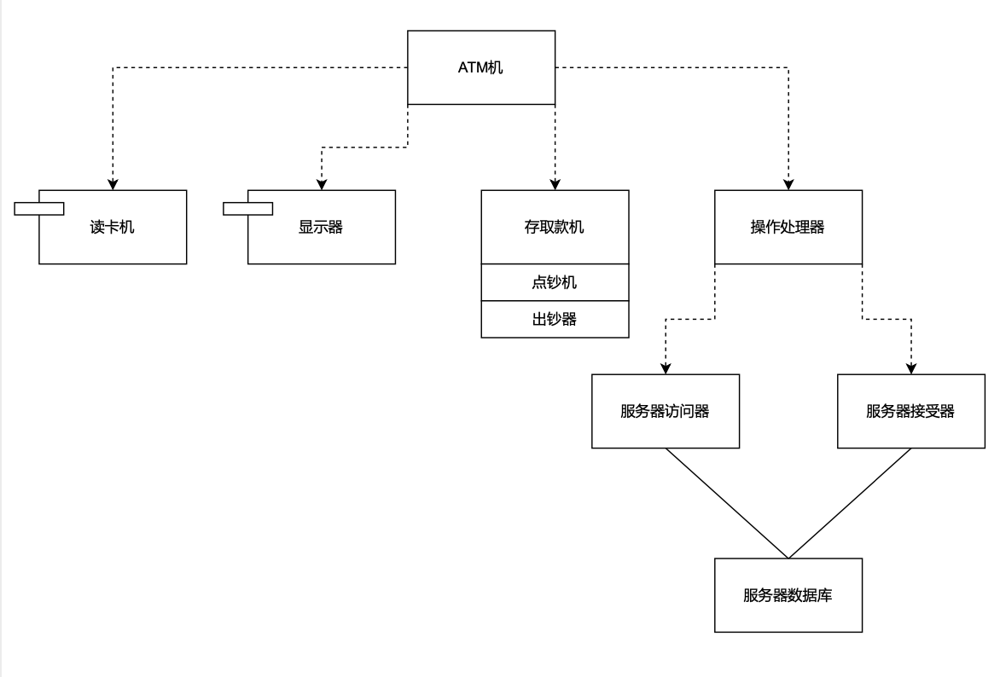
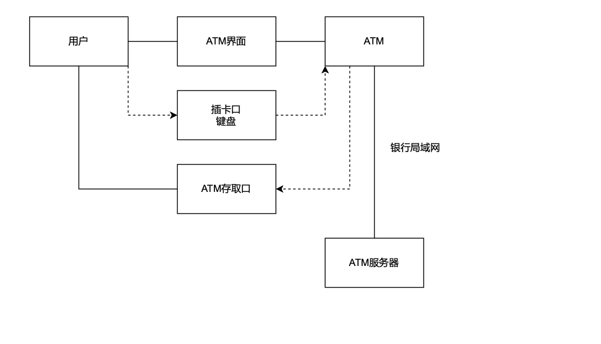

# Week4 软件工程实验报告

| 组员名单 | 黄梓轩   | 李嘉毅  | 梁恒中   |
| -------- | -------- | ------- | -------- |
| 学号     | 19335085 | 1335098 | 19335119 |

## 实验内容

- 分析 ATM 自动取款机的主要业务逻辑，绘制其九种结构类和行为类的 UML 模型图并给出适当的说明。
- 利用 git 仓库进行版本管理

## 实验分析

业务逻辑分析：

用户使用ATM，需插入银行卡到插卡口，ATM机读卡识别卡后给用户文字提示于显示屏上，用户根据需求比如：取款、存款、转账等选择操作，ATM根据用户选择的操作执行，调用相应软硬件实现用户需求，比如取款要使用点钞机和放钞器，并向服务器数据库发送更新信息。

- 对象：ATM机、用户、服务器及其子模块
- 属性：如卡号、密码、余额等
- 操作：读卡、显示、存取款、用户选择、向服务器更新等

## UML图

### 用例图

客户和维修人员可以使用这个系统，其中用户可以使用，用来办理业务，维护人员可以维护，处理异常情况。

### 类图

具体说明了ATM的页面，以及所有的ATM可以进行的操作，在ATM展示层获得信息之后，将其传递到下一层逻辑层处理，根据业务的不同作出不同的操作，来操作最后物理层的数据。

### 对象图

实例出三张银行卡插入三个ATM机器，分别在做存款，取款，登陆三种不同的操作。

### 状态图

在银行卡插入ATM后，首先进入登陆界面，如果登陆成功，那么可以根据不同的业务，修改或者查询自己的余额，可以重复回到选择业务的界面，也可以退出。如果登陆失败，那么直接退出。

### 活动图

表明了不同活动的约束

### 时序图

表明了不同类之间的通信关系。

### 协作图

描述了各个元件之间的通信过程，包括用户与ATM、ATM与服务器两块，内部细分为用户与屏幕、插卡、输出之间的通信关系。

### 构件图

描述了ATM机的各物理元件以及ATM服务器的物理关系。

### 部署图

展示了用户、ATM与服务器之间的物理部署与连接关系。

